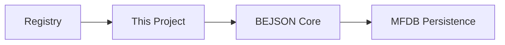

# Multi_LLM_CLI_Suite
> Part of the Elton Boehnen BEJSON Ecosystem.

 

## Overview
This repository is a standardized component of the **BEJSON Ecosystem**. It adheres to the 2026 AX (Agent Experience) standards for machine-interoperability and positional integrity data structures.

## Ecosystem Visual

## Quick Start
Check the **Admin System Registry** on the host device for local pathing and synchronization status.

---
**Elton Boehnen** · eltonboehnen@gmail.com · [github.com/boehnenelton](https://github.com/boehnenelton)
